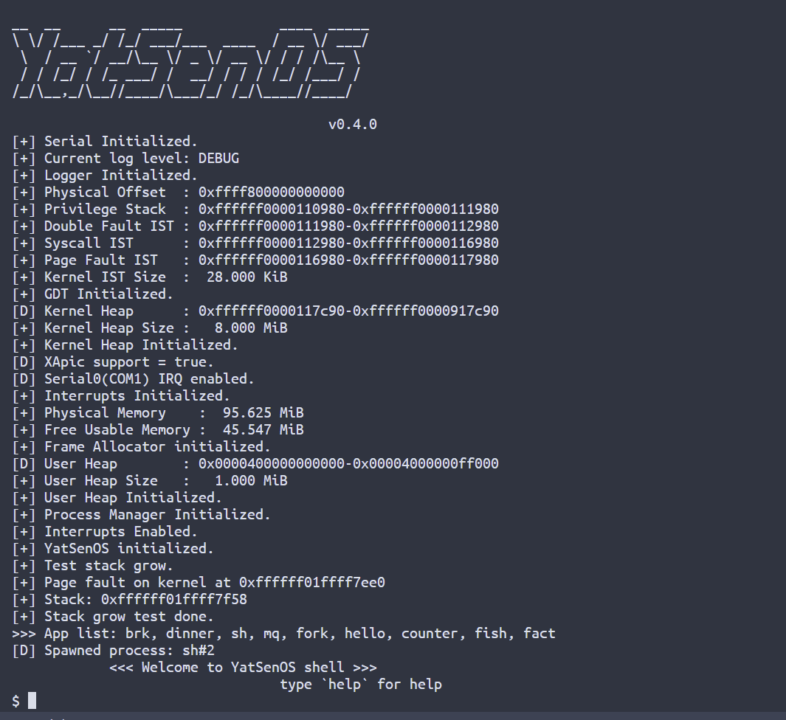
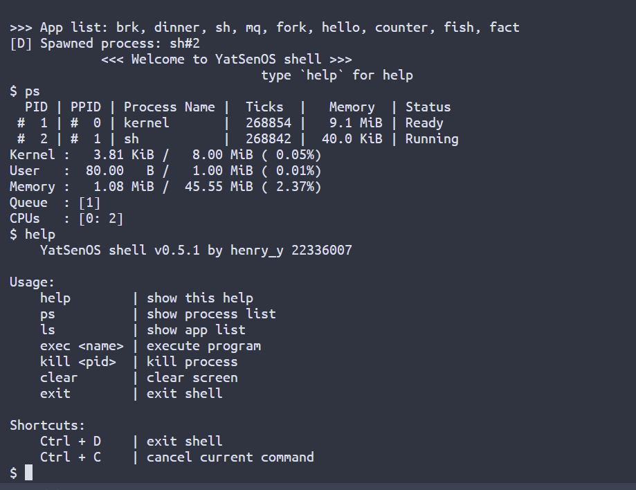

## 中山大学 YatSenOS v2 操作系统实验

YatSenOS v2 是一套基于 Rust、面向 UEFI 和 x86_64 的操作系统课程实验方案。

课程链接：https://yatsenos.github.io/YatSenOS-Tutorial-Volume-2/

本仓库为 中山大学 2022 级本科生 henry_y 的实验内容，仅供学习交流参考，请勿抄袭！

## 实验列表

✅实验零：环境搭建与实验准备

✅实验一：操作系统的启动

✅实验二：中断处理

✅实验三：内核线程与缺页异常

✅实验四：用户程序与系统调用

✅实验五：fork 的实现、并发与锁机制

❌实验六：硬盘驱动与文件系统

✅实验七：更好的内存管理

❌实验八：扩展实验

## 使用方法

使用 `make run` 即可一键启动。

## Demo

